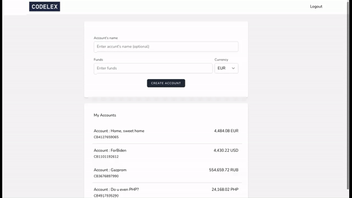

## Codelex Banking
### (Final Assignment)

### Initial Task

Using the Laravel PHP framework, create a basic “banking” application which satisfies the following user stories.

- As a User, I can sign up for a User account, so that I can access the application.
- As a User, I can login to my account (two factor authentication should be implemented).
- As a User, I can logout of my account.
- As a User, I can create an account with different currencies.
- As a User, I can view a list of my accounts.
- As a User, I can create a Transaction from one account to another.
- For transaction confirmation Google 2 factor authentication should be implemented.
- In case of different currencies, live exchange rates from Bank of Latvia should be used.
- As a User, I can see all the Transactions in my account.

### Other features worth mentioning

- For transaction form Livewire is used to dynamically search for a recipient account by account number or name.
- Once the form is prefilled, live feedback is provided about recipient, exchange rates etc.
- For 2 Factor Auth, Google Authenticator is used.
- There are integration tests, covering controller actions, including edge cases.

### Worth noting...

- A presenter classes are used to format funds.
- Funds are stored in smallest monetary value in DB as integer (cents for example)
- For a transaction 2 records are made, making it easy to track incoming and outgoing amounts for an individual account.
- Exchange rates are cached for 10 minutes.

### Full UI's video

https://www.loom.com/share/ff553cfec80b4ff3b59c8497c5d7472f
